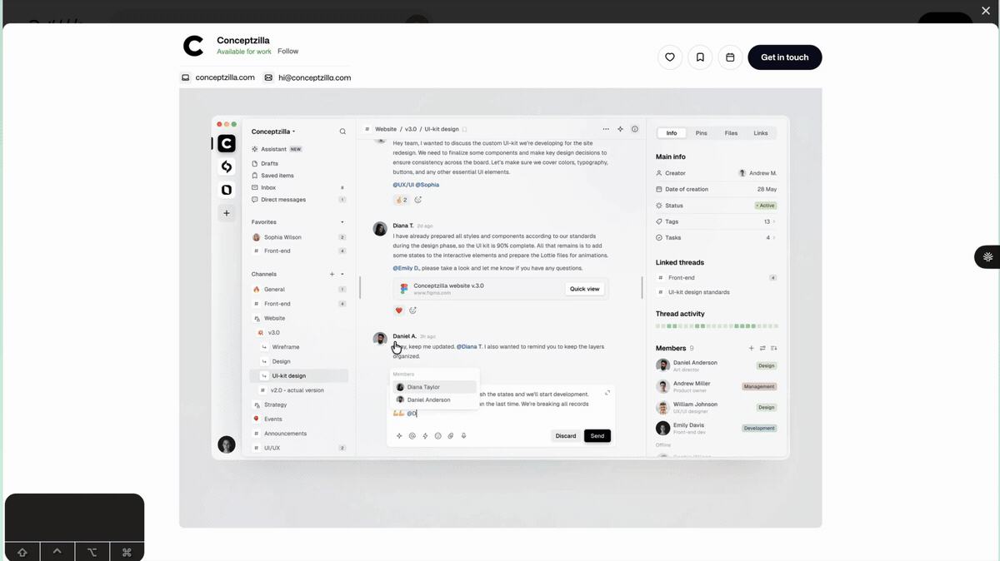

# Herdr S3 Image Publisher


Publish an image from your system clipboard to S3-compatible storage, then
insert a public or time-limited presigned URL into the focused Herdr pane.

- Works with AWS S3, Cloudflare R2, MinIO, Backblaze B2, DigitalOcean Spaces, Wasabi, and other S3-compatible services.
- Supports macOS, Linux, and Windows.
- Keeps private buckets private by generating temporary presigned URLs.
- Produces URLs that can be reused in documentation, issues, messages, and tools that cannot consume a local file path.
- Provides the same masked setup wizard inside Herdr or in a regular terminal.
- Accepts either `HSC_S3_*` or `S3_*` settings without combining the two namespaces.



## Choose the right image workflow

Herdr already includes native image clipboard bridging for `herdr --remote`.
The local client copies the image to a temporary file on the remote host and
inserts that path into the remote pane. When an agent only needs the image in
the current session, use Herdr's native `remote_image_paste` action.

This plugin addresses the publishing workflow: use it when the output must be
an HTTP URL backed by storage you control.

| What you need | Use |
| --- | --- |
| Give an image directly to an agent through `herdr --remote` | [Herdr's native remote image paste](https://herdr.dev/docs/persistence-remote/#remote-attach-over-ssh) |
| Insert a public URL that can be reused outside the current session | This plugin in public mode |
| Keep the bucket private while sharing temporary access | This plugin in presigned mode |
| Publish through your own bucket, custom domain, or CDN | This plugin |
| Avoid uploading or retaining the image | Herdr's native remote image paste |

In short: if the agent only needs the pixels now, use native remote paste. If
the result needs to be a URL, use this plugin.

## Quick start

### 1. Check the requirements

You need [Herdr](https://herdr.dev/docs/install/) 0.7.0 or later, Node.js 20 or later, and an S3-compatible bucket with upload credentials.

Linux also needs `wl-paste` on Wayland or `xclip` on X11. See [Platform support](docs/platforms.md).

### 2. Install the plugin

```bash
herdr plugin install jagzmz/herdr-s3-clipboard
```

### 3. Configure storage

Run the setup wizard from a regular terminal. Herdr does not need to be running:

```bash
npx --yes github:jagzmz/herdr-s3-clipboard setup
```

Or open the same wizard inside a running Herdr workspace:

```bash
herdr plugin action invoke hsc.s3-clipboard.configure
```

If you do not have storage yet, the wizard can explain the supported providers and link to their credential guides before continuing.

### 4. Confirm the keybinding

After saving storage settings, the wizard offers `prefix+i` as the upload
keybinding. It checks the existing Herdr config first. If that key is already
used, the wizard identifies the conflicting command and lets you enter another
key or leave keybindings unchanged.

When confirmed, the wizard backs up the existing config, adds the binding, and
tries to reload Herdr. If you skip that step, add this block manually:

```toml
[[keys.command]]
key = "prefix+i"
type = "plugin_action"
command = "hsc.s3-clipboard.upload-clipboard-image"
description = "publish clipboard image"
```

The wizard discovers Herdr's active config path, including
`HERDR_CONFIG_PATH` overrides. Reload a manual change with:

```bash
herdr server reload-config
```

### 5. Publish an image

1. Copy an image or screenshot to the system clipboard.
2. Focus the destination Herdr pane.
3. Press your Herdr prefix, then `i`. The default prefix is `ctrl+b`.
4. Wait for the generated URL to appear at the prompt.

The prompt changes only after the upload succeeds. A missing image or failed upload leaves the prompt untouched and shows a notification.

## Documentation

| Guide | Use it for |
| --- | --- |
| [Documentation index](docs/README.md) | Find every user and developer guide. |
| [Why URL publishing is different](https://maheshjaganiya.dev/blog/herdr-s3-clipboard-image-uploader/) | Compare native remote image paste with S3-backed URL publishing. |
| [Install, update, or uninstall](docs/installation.md) | Manage a GitHub install or local development link. |
| [Configuration](docs/configuration.md) | Choose a provider, URL mode, and environment settings. |
| [Platform support](docs/platforms.md) | Set up clipboard access on macOS, Linux, or Windows. |
| [Troubleshooting](docs/troubleshooting.md) | Diagnose setup, clipboard, upload, and URL failures. |
| [Security policy](SECURITY.md) | Protect credentials and report vulnerabilities privately. |
| [Development guide](docs/development.md) | Set up a checkout, run tests, and verify a change. |
| [Contributing](CONTRIBUTING.md) | Prepare and submit a focused contribution. |
| [Agent instructions](AGENTS.md) | Follow repository rules when using a coding agent. |

## How it works

For each published image, the plugin:

1. Reads the image from the clipboard on the machine running the Herdr server.
2. Uploads it with a key such as `images/2026/07/15/<uuid>.png`.
3. Generates a presigned GET URL or constructs a URL from your public base URL.
4. Sends the URL to the pane that invoked the action.
5. Optionally presses Enter when `HSC_AUTO_SUBMIT=true`.

The plugin uses the standard S3 API through the AWS SDK. It does not set object ACLs or use provider-specific upload code.

## Configuration safety

Use the plugin-specific `HSC_S3_*` settings when possible. Equivalent `S3_*` settings are accepted for compatibility, but the namespaces are selected atomically:

- If any `HSC_S3_*` setting exists, the plugin reads only that namespace.
- A partial `HSC_S3_*` configuration fails with the missing keys listed.
- `S3_*` settings are used only when no `HSC_S3_*` setting exists.

The plugin never fills missing `HSC_S3_*` values from `S3_*`. See [Namespace selection](docs/configuration.md#namespace-selection) for the full rules.

## License

No open-source license has been selected yet. The source is publicly visible, but reuse rights are not granted until a license is added.
